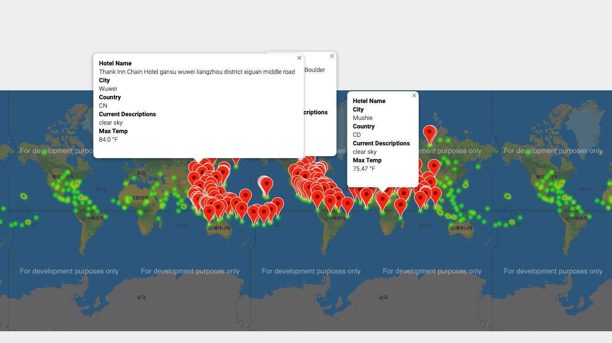
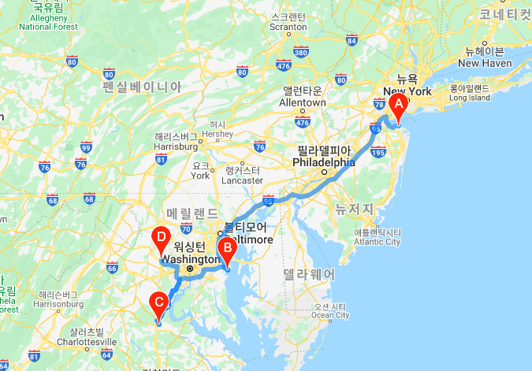
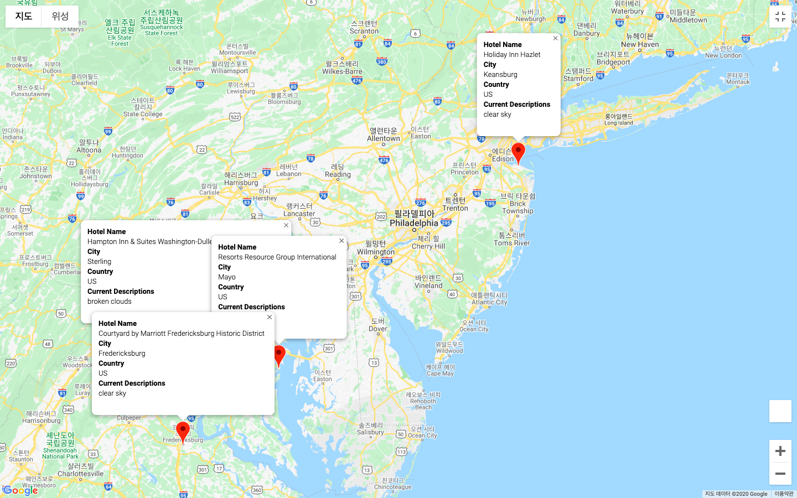

# World_Weather_Analysis

## Cahllenge Overview
We are working on data to implement customer feedback for a company, PlanMyTrip. For the following project, PlnMyTrip will use the weather data to recommend ideal hotels based on clients’ weather preferences as well as show a the directions for customers' travel itinerary.
## Resources
Python 3.7.7; Conda 4.7.12
- Data Source 1: https://openweathermap.org/api
- Data Source 2: https://maps.googleapis.com/maps/api/place/nearbysearch/json
- Software: Jupyter Notebook, Pandas Library, CityPy, Python Request, APIs, JSON Traversals

## Summary
### Part I: Get the Weather Description and Amount of Precipitation for Each City
Notebook: Weater_Database.ipynb
- Generate a new set of 1,500 random latitudes and longitudes.
- Get the nearest city using the citipy module.
- Perform an API call with the OpenWeatherMap.
- Retrieve the following information from the API call:
  - Latitude and longitude
  - Maximum temperature
  - Percent humidity
  - Percent cloudiness
  - Wind speed
  - Weather description (e.g., clouds, fog, light rain, clear sky)
  - The amount of rainfall over the last hour (1 hr).
  - The amount of snowfall over the last hour (1 hr)
    - Use multiple try-except blocks to get the amount of rainfall and snowfall. In the except block handle the KeyError if there is no rainfall or snowfall and add 0 inches for the amount.
6. Save the new DataFrame as a csv file 

### Part II: Have Customers Narrow Their Travel Searches Based on Temperature and Precipitation
Notebook: Vacation_Search.ipynb
- Import the csv file we saved from Part I
- Filter the DataFrame 
  - Prompt the customer for the minimum temperature preference.
  - Prompt the customer for the maximum temperature preference.
  - Prompt the customer to answer if he or she would like it to be raining or not, using input("Do you want it to be raining? (yes/no) ").
  - Prompt the customer to answer if he or she would like it to be snowing or not, using input("Do you want it to be snowing? (yes/no) ").
- Add the cities to a marker layer map with a pop-up marker for each city that includes:
  - Hotel name
  - City
  - Country
  - Current weather description with the maximum temperature
  
- Save the new DataFrame as a csv file

### Part III: Create a Travel Itinerary with a Corresponding Map
Notebook: Vacation_Itinerary
- Enable the “Directions API” in your Google account for your API key
- Import the csv file from Part II 
- Create a map to show the route between four cities from the customer’s possible travel destinations, and then create a map with pop-up markers for the four cities.
- Create Separate DataFrames by each city on the travel route
- Map each city on the route by getting the latitude-longitude pairs for each city DataFrame as tuples.
- Show direction based on transportation mode 
  
- Create a marker layer map for the four cities by using a combined DataFrame of the four cities
- On the marker layer map, make sure each city has a pop-up marker that contains the following:
  - Hotel name
  - City
  - Country
  - Current weather description with the maximum temperature
  
 
 
  
